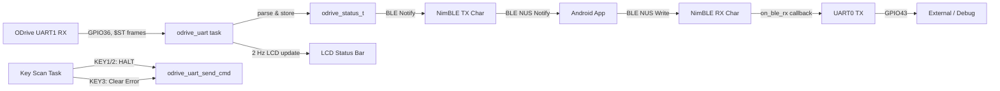
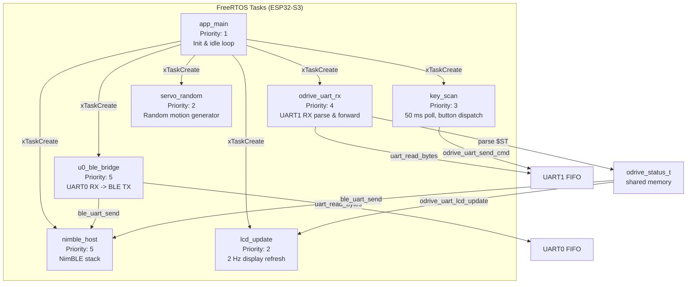

STM32 Odrive Code 路径： D:\YF_File\yff\3. FOC\3. OdriveFOC\YF Odrive Code
ESP32 BLE code路径： D:\YF_File\yff\9. MyProject\HKR_Robot\Fimrware\ESP_OdriveBLE or 再Desktop找，后期应该会直接移植到前面的路径
Android Code ：D:\YF_File\yff\9. MyProject\AndroidBot\AndroidApp\AIEdgeAPp 文件太大就不重新复制了

# HKR_Robot -- Distributed AGV Chassis Control System

**HKR_Robot** is a two-wheel differential-drive AGV chassis platform. The system adopts a distributed architecture consisting of an upper-layer mobile application (Android), a middleware communication gateway (ESP32-S3), and a lower-layer dual-motor FOC driver (STM32F405 based on ODrive V3.6 hardware). The middleware bridges BLE commands from the mobile app to the motor controller via UART, while also driving an LCD display, audio output, servo, and sensor peripherals.

---

## 1. Project Overview

### 1.1 System Topology

```
+------------------+       BLE (NUS)        +---------------------+      UART ($ST frames)      +----------------------+
|  Android App     | <--------------------> |  ESP32-S3 Gateway   | <-------------------------> |  STM32F405 ODrive     |
|  (AIEdgeApp)     |   6E400001-B5A3-F393   |  "HKR_Robot"        |    GPIO37/36, 115200 8N1   |  (V3.6 Custom FW)     |
+------------------+                        +---------------------+                            +----------------------+
                                                    |     |                                          |          |
                                         SPI (LCD)  |     | I2C (Touch)                   TIM1/TIM8 PWM |          | ADC (Current)
                                                    v     v                                          v          v
                                            +-------------+                                  +-------------------+
                                            | 240x284 LCD |                                  | 5065 BLDC x2      |
                                            | CST816 Touch|                                  | (M0 + M1)         |
                                            +-------------+                                  +-------------------+
```

### 1.2 Communication Data Flow



- **Downlink (Command)**: Mobile App -> BLE -> `on_ble_rx` -> ODrive UART -> STM32
- **Uplink (Telemetry)**: STM32 -> ODrive UART -> `odrive_status_t` -> BLE Notify -> Mobile App
- **Active Reporting**: `$ST,...` frames at up to 100 Hz when motors are spinning; 1 Hz when idle

---

## 2. Middleware Gateway (ESP_OdriveBLE)

The ESP32-S3 middleware acts as a BLE-to-UART bridge, human-machine interface (HMI), and sensor hub.

### 2.1 Hardware PinMap


#### 2.1.1 UART Interfaces

| Interface | ESP32-S3 Pin | Direction | Connected To | Baud Rate | Notes |
|-----------|-------------|-----------|-------------|-----------|-------|
| UART0 TXD | GPIO 43 | Output | Debug / External | 115200 | BLE-to-UART transparent bridge |
| UART0 RXD | GPIO 44 | Input | Debug / External | 115200 | UART-to-BLE transparent bridge |
| UART1 TX | GPIO 37 | Output | STM32 USART2 RX (PA3) | 115200 | ODrive command channel |
| UART1 RX | GPIO 36 | Input | STM32 USART2 TX (PA2) | 115200 | ODrive telemetry channel |
| UART2 TX | GPIO 2 | Output | Reserved | 115200 | Backup / auxiliary UART |
| UART2 RX | GPIO 1 | Input | Reserved | 115200 | Backup / auxiliary UART |

#### 2.1.2 LCD Display (SPI)

| Signal | GPIO | Notes |
|--------|------|-------|
| SCK | 14 | SPI2 clock |
| MOSI | 15 | SPI2 data (3-wire, MISO not connected) |
| DC | 17 | Data / Command select |
| CS | 18 | Chip select |
| RST | 16 | Reset |
| BLK | 48 | Backlight control (active low via N-MOS) |

- Resolution: 240 x 284 (horizontal mode)
- Controller: ST7789-compatible

#### 2.1.3 Touch Panel (I2C)

| Signal | GPIO | Notes |
|--------|------|-------|
| SDA | 8 | I2C0 data |
| SCL | 9 | I2C0 clock |
| RST | 21 | Touch controller reset |
| INT | 47 | Touch interrupt input |

- Controller: CST816
- Device Address: 0x15

#### 2.1.4 GPIO Peripherals

| Peripheral | GPIO | Type | Notes |
|-----------|------|------|-------|
| LED1 | 5 | Output | Active low |
| LED2 | 6 | Output | Active low |
| LED3 | 7 | Output | Active low |
| LED4 | 4 | Output | Active low |
| KEY1 | 38 | Input | Pull-down, press = HIGH (M0 emergency stop) |
| KEY2 | 45 | Input | Pull-down, press = HIGH (M1 emergency stop) |
| KEY3 | 46 | Input | Pull-down, press = HIGH (Clear errors) |
| KEY4 | 3 | Input | Pull-down, press = HIGH (Audio beep) |
| Audio PWM | 42 | Output | LEDC PWM -> NS4150 amplifier |
| Servo | 41 | Output | 50 Hz PWM, MG90 servo |

#### 2.1.5 SD Card (SPI, Reserved)

| Signal | GPIO | Notes |
|--------|------|-------|
| CS | 10 | Chip select |
| MOSI | 11 | Data output |
| SCK | 12 | Clock |
| MISO | 13 | Data input |

### 2.2 Flash Partition Table

The firmware targets ESP32-S3 with 8 MB external flash.

| Name | Type | SubType | Offset | Size | Description |
|------|------|---------|--------|------|-------------|
| nvs | data | nvs | 0x9000 | 0x6000 (24 KB) | Non-volatile storage (WiFi/BLE calibration, user config) |
| phy_init | data | phy | 0xf000 | 0x1000 (4 KB) | PHY initialization data |
| factory | app | factory | 0x10000 | 0x300000 (3 MB) | Main application firmware |

Flash layout overview:

```
0x000000  +---------------------------+
          |      Bootloader (36 KB)    |
0x009000  +---------------------------+
          |      NVS (24 KB)          |
0x00F000  +---------------------------+
          |      PHY Init (4 KB)      |
0x010000  +---------------------------+
          |      Factory App (3 MB)   |
0x310000  +---------------------------+
          |      Unused (~5 MB)       |
0x800000  +---------------------------+
```

### 2.3 RTOS Task Architecture



### 2.4 System State Machine

```mermaid
stateDiagram-v2
    [*] --> BOOT: Power-on / Reset
    BOOT --> INIT_NVS: Bootloader OK
    INIT_NVS --> INIT_PERIPH: NVS initialized
    INIT_PERIPH --> INIT_BLE: LEDs, Audio, UART ready

    INIT_BLE --> BLE_ADVERTISING: NimBLE stack started<br/>Broadcasting "HKR_Robot"

    BLE_ADVERTISING --> PAIRED: BLE central connected
    BLE_ADVERTISING --> BLE_ADVERTISING: Timeout, re-advertise

    PAIRED --> NORMAL_OP: ODrive UART link established

    state NORMAL_OP {
        [*] --> IDLE: No Hall edge for 500 ms
        IDLE --> MOVING: Hall edge detected
        MOVING --> IDLE: 500 ms no Hall edge
        MOVING --> FAULT: Error code != 0 in $ST frame
        IDLE --> FAULT: Error code != 0 in $ST frame
    }

    NORMAL_OP --> DISCONNECTED: BLE link lost
    DISCONNECTED --> BLE_ADVERTISING: Re-enter advertising

    FAULT --> FAULT_HANDLED: User clear-error command ($Mx,E,0;)
    FAULT --> FAULT_HANDLED: Hardware KEY3 pressed
    FAULT_HANDLED --> NORMAL_OP: Recalibration success

    PAIRED --> SHUTDOWN: Power loss / critical error
    NORMAL_OP --> SHUTDOWN: Power loss / critical error
```



---

## 3. Lower-Layer Motor Driver (STM_Odrive3.6)

The STM32F405-based firmware is a customized fork of ODrive V0.3.6, adapted for the YOD 5065 BLDC motors with Hall-sensor feedback and an extended UART command protocol.

### 3.1 Motor Specifications (5065 BLDC)

| Parameter | Value | Unit |
|-----------|-------|------|
| Model | 5065 | -- |
| Max Power | 1800 | W |
| Recommended Voltage | 24 -- 36 | V |
| kV Rating | 270 | rpm/V |
| Pole Pairs | 7 (14 poles) | -- |
| No-Load Current | 0.5 -- 1.0 | A |
| No-Load Speed | 6480 -- 9600 | rpm |
| Hall Sensor Angle | 60 | degrees |
| Rated Torque | 1.5 -- 2.0 | N.m |

### 3.2 ODrive V3.6 Interface Mapping


#### 3.2.1 Communication Interfaces

| Interface | STM32 Pin | Connected To | Baud Rate | Function |
|-----------|-----------|-------------|-----------|----------|
| USART2 TX | PA2 | ESP32 GPIO 36 | 115200 | User protocol telemetry |
| USART2 RX | PA3 | ESP32 GPIO 37 | 115200 | User protocol command |
| UART4 TX | PA0 | Reserved (debug) | 115200 | Raw ODrive ASCII protocol |
| UART4 RX | PA1 | Reserved (debug) | 115200 | Raw ODrive ASCII protocol |
| USB CDC | PA11/PA12 | USB connector | -- | Debug / PC interface |

#### 3.2.2 Motor Phase PWM

| Motor | Timer | High-Side Pins | Low-Side Pins | Frequency | Dead Time |
|-------|-------|---------------|---------------|-----------|-----------|
| M0 | TIM1 | PA8, PA9, PA10 | PB13, PB14, PB15 | 8.24 kHz | 119 ns |
| M1 | TIM8 | PC6, PC7, PC8 | PA7, PB0, PB1 | 8.24 kHz | 119 ns |

#### 3.2.3 Hall Sensor Inputs

| Motor | Hall-A | Hall-B | Hall-C |
|-------|--------|--------|--------|
| M0 | PB4 (M0_ENC_A) | PB5 (M0_ENC_B) | PC9 (M0_DC_CAL pad) |
| M1 | PB6 (M1_ENC_A) | PB7 (M1_ENC_B) | PC15 (M1_DC_CAL pad) |

#### 3.2.4 Current Sensing (ADC1)

| Channel | STM32 Pin | Signal |
|---------|-----------|--------|
| ADC1_IN10 | PC0 | M0 Phase B current |
| ADC1_IN11 | PC1 | M0 Phase C current |
| ADC1_IN12 | PC2 | M1 Phase C current |
| ADC1_IN13 | PC3 | M1 Phase B current |

#### 3.2.5 Gate Driver (DRV8301 via SPI3)

| Signal | GPIO | Function |
|--------|------|----------|
| SCK | PC10 | SPI3 clock (5.25 MHz) |
| MISO | PC11 | SPI3 MISO |
| MOSI | PC12 | SPI3 MOSI |
| CS_M0 | PC13 | M0 DRV8301 chip select |
| CS_M1 | PC14 | M1 DRV8301 chip select |
| EN_GATE | PB12 | Gate driver enable |
| nFAULT | PD2 | Fault input (shared, EXTI) |

### 3.3 UART Communication Protocol

The full protocol specification is maintained in a standalone reference document:

> **Protocol Reference**: [UART_Protocol_Examples.md](./STM_OdriveV3.6/ODrive-fw-v0.3.6_YOD_5065/Readme/UART_Protocol_Examples.md)

#### 3.3.1 Protocol Summary

**Physical Layer**: USART2, 115200 baud, 8N1, no flow control

**Frame Types**:

| Direction | Format | Purpose |
|-----------|--------|---------|
| PC/Host -> Board | `$<CH>,<CMD>,<VAL>;\n` | Command frame |
| Board -> PC/Host | `$ST,<14 fields>;\r\n` | Active telemetry (up to 100 Hz) |
| Board -> PC/Host | `[<CH>,<CMD>,<fields>]` | Command reply |

**Command Modes**:

| Code | Function | Value Unit | Example |
|------|----------|-----------|---------|
| `V` | Velocity control | km/h | `$M0,V,5.0;` |
| `P` | Position control | degrees | `$M0,P,90.0;` |
| `T` | Torque control | N.m | `$M0,T,0.5;` |
| `I` | Current control | A (Iq) | `$M0,I,3.0;` |
| `H` | Halt (emergency stop) | -- | `$M0,H,0;` |
| `Q` | Query status | -- | `$M0,Q,0;` |
| `E` | Clear error & recalibrate | -- | `$M0,E,0;` |

**Active Telemetry $ST Frame (14 fields)**:

```
$ST,<vb>,<fault>,<M0h>,<M0c>,<M0v>,<M0i>,<M0e>,<M0s>,<M1h>,<M1c>,<M1v>,<M1i>,<M1e>,<M1s>;\r\n
```

| Index | Field | Description |
|-------|-------|-------------|
| 0 | `vb` | VBUS voltage (V) |
| 1 | `fault` | DRV8301 fault code |
| 2 | `M0h` | M0 Hall state (1-6) |
| 3 | `M0c` | M0 cumulative Hall count |
| 4 | `M0v` | M0 mechanical velocity (rad/s) |
| 5 | `M0i` | M0 Iq current (A) |
| 6 | `M0e` | M0 error code |
| 7 | `M0s` | M0 status bits (bit0=calibrated, bit1=enabled) |
| 8-13 | `M1*` | M1 equivalents of fields 2-7 |

**Extended Error Codes**:

| Code | Macro | Description |
|------|-------|-------------|
| 0 | `ERROR_NO_ERROR` | No error |
| 1-12 | Standard ODrive errors | Phase resistance, inductance, encoder, ADC, FOC timing |
| 19 | `ERROR_SPIN_UP_TIMEOUT` | Sensorless spin-up timeout |
| 20 | `ERROR_DRV_FAULT` | DRV8301 gate driver fault |
| 23 | `ERROR_UNDER_VOLTAGE` | VBUS under-voltage |
| 24 | `ERROR_MOTOR_STALL` | Motor stall detected (3 s watchdog) |

---

## 4. Build and Flash Guide

### 4.1 ESP_OdriveBLE (ESP32-S3 Gateway)

**Prerequisites**:

- ESP-IDF v5.x (tested with v5.2+)
- ESP32-S3 toolchain (Xtensa)

```bash
# Navigate to the project directory
cd ESP_OdriveBLE/ESP_OdriveBLEBoard

# Set target chip
idf.py set-target esp32s3

# Configure (review partition table, BLE settings)
idf.py menuconfig

# Build
idf.py build

# Flash (replace PORT with your serial port)
idf.py -p /dev/ttyUSB0 flash

# Monitor
idf.py -p /dev/ttyUSB0 monitor
```

**Key Configuration Items**:

| Setting | Value | Notes |
|---------|-------|-------|
| Target | `esp32s3` | Set in `sdkconfig.defaults` |
| Flash Size | 8 MB | Must match hardware |
| Partition Table | Custom CSV | `partitions.csv` |
| BLE Stack | NimBLE | Nordic UART Service |
| FreeRTOS Tick | 1000 Hz | Required for servo PWM precision |

### 4.2 STM_Odrive3.6 (STM32F405 Motor Driver)

**Prerequisites**:

- Keil MDK-ARM (compatible with the `.uvprojx` project file)

```bash
# The Keil project is located at:
# STM_OdriveV3.6/ODrive-fw-v0.3.6_YOD_5065/mdk_app/

# Open the project in Keil MDK:
# - Select target appropriate for your debug probe (ST-Link / J-Link)
# - MOTOR_CONFIG is set in app_config.h:
#     1 = 4250 motor
#     2 = 5065 motor (default)
# - APP_USE_HALL_SENSOR = 1 for Hall sensored FOC
# - APP_USE_HALL_SENSOR = 0 for sensorless FOC

# Build: F7
# Flash: F8
```

**Hal Sensor Mode Configuration** (`app_config.h`):

```c
#define MOTOR_CONFIG            2    // 2 = 5065 motor
#define APP_USE_HALL_SENSOR     1    // 1 = Hall sensored, 0 = sensorless
#define APP_M0_HALL_MOTOR_DIR   1    // Motor direction: 1 or -1
#define APP_M1_HALL_MOTOR_DIR   1
```

### 4.3 Factory Test Sequence

After flashing both devices, verify system integrity:

```bash
# Step 1: Verify BLE advertising
# Scan for "HKR_Robot" in your BLE app

# Step 2: Verify UART link
# Send query command via BLE UART TX characteristic
$M0,Q,0;

# Expected reply (example):
# [M0,Q,0.000,0.00,0.000,24.20,0]

# Step 3: Motor spin test
$M0,I,2.0;    # Low-current open-loop check
$M0,H,0;      # Stop
$M0,V,5.0;    # Velocity mode, 5 km/h
$M0,H,0;      # Stop
```

---

## 5. Directory Structure

```
Firmware/
├── README.md                              # This document
├── pic/
│   ├── Assembly.jpg                       # System assembly reference
│   ├── esp32s3_pinout.png                 # ESP32-S3 pinout diagram
│   └── odrive_wiring.png                  # ODrive V3.6 wiring reference
├── ESP_OdriveBLE/
│   └── ESP_OdriveBLEBoard/
│       ├── CMakeLists.txt                 # Project "P169H002"
│       ├── partitions.csv                 # Flash partition table
│       ├── sdkconfig.defaults             # ESP-IDF SDK configuration
│       ├── main/
│       │   ├── main.c                     # Entry point, task creation
│       │   ├── ble_uart.c/.h              # NimBLE Nordic UART Service
│       │   ├── odrive_uart.c/.h           # ODrive $ST frame parser
│       │   ├── peripheral_ctrl.c/.h       # LED, Key, Audio, SD card
│       │   ├── servo_control.c/.h         # MG90 servo (cubic spline smooth)
│       │   ├── audio_processor.cpp/.h     # Audio pipeline
│       │   ├── dify_chat.c/.h             # Dify AI chat client
│       │   ├── Inc/                       # LCD driver, touch, JPEG decoder
│       │   └── Src/                       # LCD, touch, I2C HAL implementations
│       └── ref/
│           ├── Odrive_UART_Protocol_Examples.md
│           └── ...                        # Additional reference docs
├── STM_OdriveV3.6/
│   └── ODrive-fw-v0.3.6_YOD_5065/
│       ├── Firmware/
│       │   ├── Inc/                       # main.h, app_config.h, GPIO defines
│       │   ├── Src/                       # usart.c, main.c, HAL MSP
│       │   └── MotorControl/              # FOC loop, commands.c, low_level.c
│       ├── Readme/
│       │   ├── UART_Protocol_Examples.md  # Protocol specification (authoritative)
│       │   ├── Hardware_PinMap_ErrorCodes.md
│       │   └── ...
│       └── mdk_app/                       # Keil MDK project files
└── readme.txt                             # Legacy path reference
```

---

## 6. Key Engineering Notes

- **BLE Command Throughput**: Commands from the mobile app are forwarded as raw strings. Mult-command frames separated by `;` are supported (e.g., `$M0,V,5.0;$M1,V,5.0;`).
- **Telemetry Rate**: Active `$ST` reporting runs at up to 100 Hz during motion (Hall edge-triggered) and drops to 1 Hz at rest to conserve UART bandwidth.
- **Motor Stall Protection**: A 3-second stall watchdog (error code 24) triggers if the Hall state fails to advance while the motor is under drive current. This is an extension beyond the standard ODrive error set.
- **Hall Sensor Startup**: When `APP_USE_HALL_SENSOR=1`, the firmware applies a configurable feed-forward current (`APP_Mx_HALL_STARTUP_CURRENT`) to overcome static friction before entering closed-loop control.
- **Phase Offset Tuning**: If a motor oscillates or fails to start, the Hall phase offset (`APP_Mx_HALL_PHASE_OFFSET`) should be swept through values 0.5, 1.5, 2.5, 3.5, 4.5, 5.5 to find the correct alignment.
- **Flash Size Verification**: The ESP32-S3 module must have 8 MB of external flash. The factory partition allocates 3 MB for the application, leaving approximately 5 MB unused (available for future OTA or FATFS partitions).
